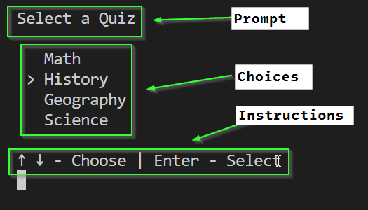

# Quiz Program Challenge

In this challenge, you will implement a program for giving multiple choice
quizzes in the terminal.

## Run the Solution

Before starting, take a look at what a final solution might look like:

From the root directory of this project, run `dotnet Solutions/Quiz.dll`

## Tasks

## Create a Menu Class

Start by creating class to represent a menu that the user can use to select from
a list of options.

### Requirements:

1. The class must have 2 properties:
   * Prompt (`string`) - Displayed above the menu
   * Options (`string[]`) - an array of options the user can select from
2. The class must have a constructor that initializes the Prompt and the Options
3. The class must have 1 method `GetChoice()`
   * This method displays the Prompt, the Options, and instructions for
     selecting an option. The user can use the up and down arrow to change their
     choice and press enter to select the currently selected option. After
     pressing enter, the method returns the selected string.

The following code should produce the picture shown below it:

```csharp
Menu menu = new("Select a Quiz", ["Math", "History", "Geography", "Science"]);
string choice = menu.GetChoice();
```



### Example: Reading Key Presses

There is an example program in the `KeyPressExample` folder that might be helpful to understand how to read a single keyboard input.

### Hint: Partial Implementation

If you're not sure how to start, there is a similar implementation in the `SimpleMenuExample` folder that might be helpful getting started with the `GetChoice()` method. Note: Your method should use up and down arrows and display a `>` on the currently selected option.

## Create a Question Class

Create a class called Question which will represent a multiple choice question in your quiz that has a single correct answer.

### Requirements

1. The Question class should have 2 properties:
   * A `Menu` with the possible options
   * A `string` that is the correct answer
2. A Constructor to initialize the menu and answer
3. A Method `AskQuestion()` which displays the menu, waits for the user to answer the question, and then returns `true` if the user selected the correct answer and `false` if the user did not select the correct answer.

*Hint*: This method should call your menu's `GetChoice()` method and then check if the returned string matches the correct answer.

If you have implemented it correctly, you should be able to write the following code in your `Program.cs`:

```csharp
Menu menu = new Menu("2 + 7", ["9", "3", "5", "27"]);
string correct = "9";
Question twoPlusSeven = new Question(menu, correct);
if(twoPlusSeven.AskQuestion())
{
   Console.WriteLine("Correct!");
}
else
{
   Console.WriteLine("That was not correct.");
}
```

## Create a Quiz Class

The `Quiz` class represents several questions that can be taken together.

### Requirements

1. A quiz has one property, an array of questions `Question[]`
2. A constructor to initialize the questions
3. A method `TakeQuiz()` that loops through each question in the quiz and calls
   `AskQuestion()`. The result of each question is displayed. Finally, after
   each question has been answered, a message is displayed showing their score
   based on how many questions were answered correctly.

When you have finished implementing the Quiz class, the following code
should work in your `Program.cs` file. The user is given a math quiz and then shown their final score.

```csharp
Quiz mathQuiz = new Quiz(
    [
        new Question(new Menu("2 + 7", ["9", "3", "5", "27"]), "9"),
        new Question(new Menu("8 x 8", ["16", "32", "88", "64"]), "64"),
        new Question(new Menu("14 ÷ 2", ["12", "7", "142", "8"]), "7"),
        new Question(new Menu("Solve for X: 3X - 7 = 11", ["3", "5", "6", "9"]), "6"),
        new Question(new Menu("Solve for Y: 4Y + 8 = 20", ["3", "5", "6", "9"]), "3"),
    ]
);

mathQuiz.TakeQuiz();
```

## Create a Quiz Program

Using the classes you have created, write a program that has two (or more) quizzes to choose from.

1. Show a Menu to the user and ask them to select a quiz.
2. The selected quiz should be given to the user
3. After the quiz, ask the user if they would like to take another quiz
4. If yes, go to step 1. Otherwise, exit.

## Questions

You may write your own questions or you may use any of the questions below:

1. Who was the first President of the United States?
   - A) Benjamin Franklin
   - B) Thomas Jefferson
   - C) George Washington
   - D) Abraham Lincoln
   - **Answer: C) George Washington**

2. What is the capital of France?
   - A) Berlin
   - B) Madrid
   - C) Paris
   - D) Rome
   - **Answer: C) Paris**

3. Which planet is known as the Red Planet?
   - A) Venus
   - B) Mars
   - C) Jupiter
   - D) Saturn
   - **Answer: B) Mars**

4. Who wrote the Harry Potter series?
   - A) J.R.R. Tolkien
   - B) J.K. Rowling
   - C) George R.R. Martin
   - D) Stephen King
   - **Answer: B) J.K. Rowling**

5. What is the chemical symbol for water?
   - A) O
   - B) H2O
   - C) CO2
   - D) NaCl
   - **Answer: B) H2O**

6. Which of these is a famous video game franchise by Nintendo?
   - A) Call of Duty
   - B) Grand Theft Auto
   - C) The Legend of Zelda
   - D) Halo
   - **Answer: C) The Legend of Zelda**

7. What year did the Titanic sink?
   - A) 1905
   - B) 1912
   - C) 1920
   - D) 1934
   - **Answer: B) 1912**

8. Who painted the Mona Lisa?
   - A) Vincent Van Gogh
   - B) Pablo Picasso
   - C) Leonardo da Vinci
   - D) Michelangelo
   - **Answer: C) Leonardo da Vinci**

9. What is the largest ocean on Earth?
   - A) Atlantic
   - B) Indian
   - C) Pacific
   - D) Arctic
   - **Answer: C) Pacific**

10. Who is known as the "King of Pop"?
    - A) Elvis Presley
    - B) Michael Jackson
    - C) Prince
    - D) Justin Bieber
    - **Answer: B) Michael Jackson**

11. What is the capital of Japan?
    - A) Seoul
    - B) Beijing
    - C) Tokyo
    - D) Bangkok
    - **Answer: C) Tokyo**

12. In what year was the first iPhone released?
    - A) 2005
    - B) 2007
    - C) 2009
    - D) 2010
    - **Answer: B) 2007**

13. Who discovered penicillin?
    - A) Marie Curie
    - B) Alexander Fleming
    - C) Louis Pasteur
    - D) Albert Einstein
    - **Answer: B) Alexander Fleming**

14. Which element has the atomic number 1?
    - A) Oxygen
    - B) Hydrogen
    - C) Nitrogen
    - D) Carbon
    - **Answer: B) Hydrogen**

15. What is the capital of Australia?
    - A) Sydney
    - B) Melbourne
    - C) Canberra
    - D) Perth
    - **Answer: C) Canberra**

16. Who is the author of "1984"?
    - A) Aldous Huxley
    - B) George Orwell
    - C) Ray Bradbury
    - D) Stephen King
    - **Answer: B) George Orwell**

17. What is the smallest planet in our solar system?
    - A) Mercury
    - B) Venus
    - C) Earth
    - D) Mars
    - **Answer: A) Mercury**

18. In which country is the Great Pyramid of Giza located?
    - A) Mexico
    - B) Peru
    - C) Egypt
    - D) India
    - **Answer: C) Egypt**

19. What does HTML stand for?
    - A) Hyper Text Markup Language
    - B) High Tech Mainframe Link
    - C) Hyperlink and Text Markup Language
    - D) High Transfer Machine Language
    - **Answer: A) Hyper Text Markup Language**

20. Who is the main character in the video game series "The Legend of Zelda"?
    - A) Zelda
    - B) Link
    - C) Ganon
    - D) Mario
    - **Answer: B) Link**

21. What gas do plants absorb from the atmosphere for photosynthesis?
    - A) Oxygen
    - B) Carbon Dioxide
    - C) Nitrogen
    - D) Hydrogen
    - **Answer: B) Carbon Dioxide**

22. Which country is known as the Land of the Rising Sun?
    - A) China
    - B) Japan
    - C) South Korea
    - D) Thailand
    - **Answer: B) Japan**

23. Who was the ancient Greek god of the sea?
    - A) Zeus
    - B) Poseidon
    - C) Hades
    - D) Apollo
    - **Answer: B) Poseidon**

24. What is the hardest natural substance on Earth?
    - A) Gold
    - B) Iron
    - C) Diamond
    - D) Quartz
    - **Answer: C) Diamond**

25. What is the name of the first successful personal computer?
    - A) IBM PC
    - B) Apple II
    - C) Commodore 64
    - D) Atari 800
    - **Answer: B) Apple II**

26. Which of these countries is NOT in Europe?
    - A) Switzerland
    - B) Norway
    - C) Australia
    - D) Finland
    - **Answer: C) Australia**

27. What is the main ingredient in traditional sushi?
    - A) Chicken
    - B) Beef
    - C) Fish
    - D) Pork
    - **Answer: C) Fish**

28. Who is the creator of the theory of relativity?
    - A) Isaac Newton
    - B) Albert Einstein
    - C) Nikola Tesla
    - D) Stephen Hawking
    - **Answer: B) Albert Einstein**

29. In what year did World War II end?
    - A) 1945
    - B) 1950
    - C) 1942
    - D) 1939
    - **Answer: A) 1945**

30. Which of these is a primary color?
    - A) Green
    - B) Orange
    - C) Red
    - D) Purple
    - **Answer: C) Red**
